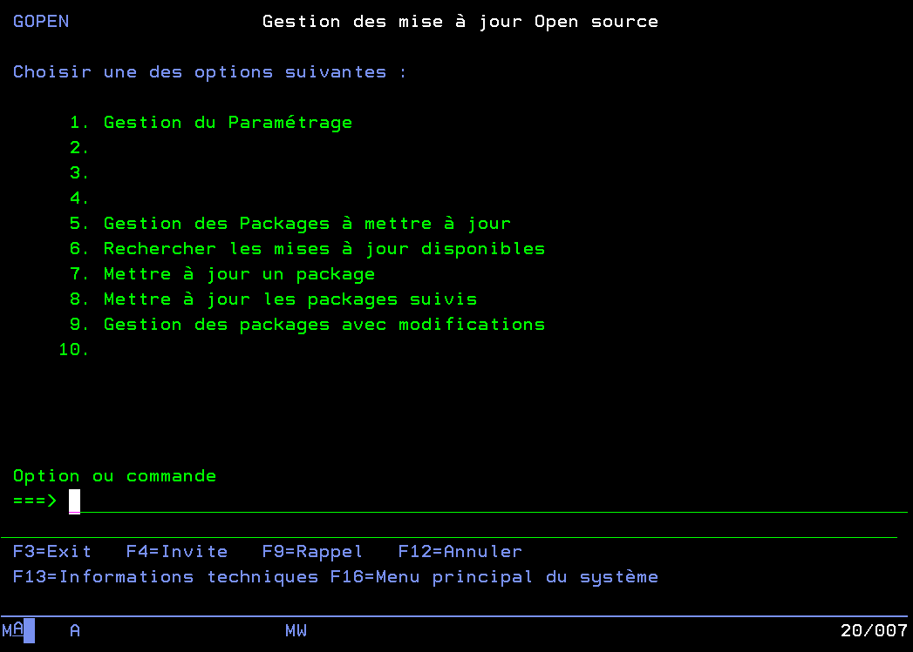
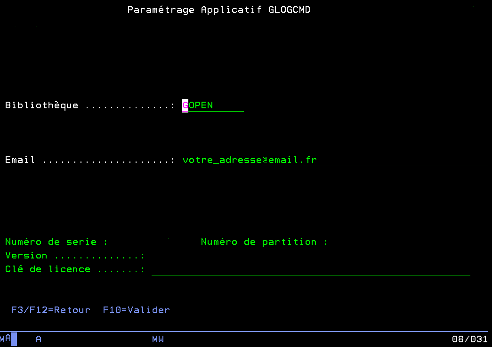
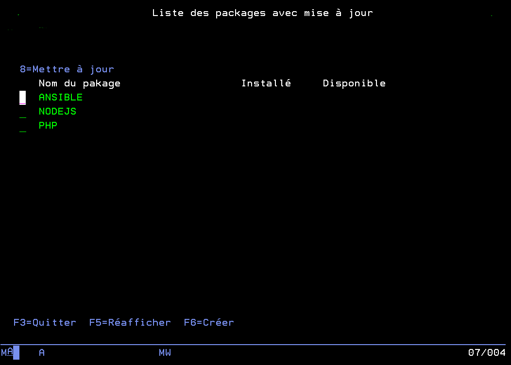
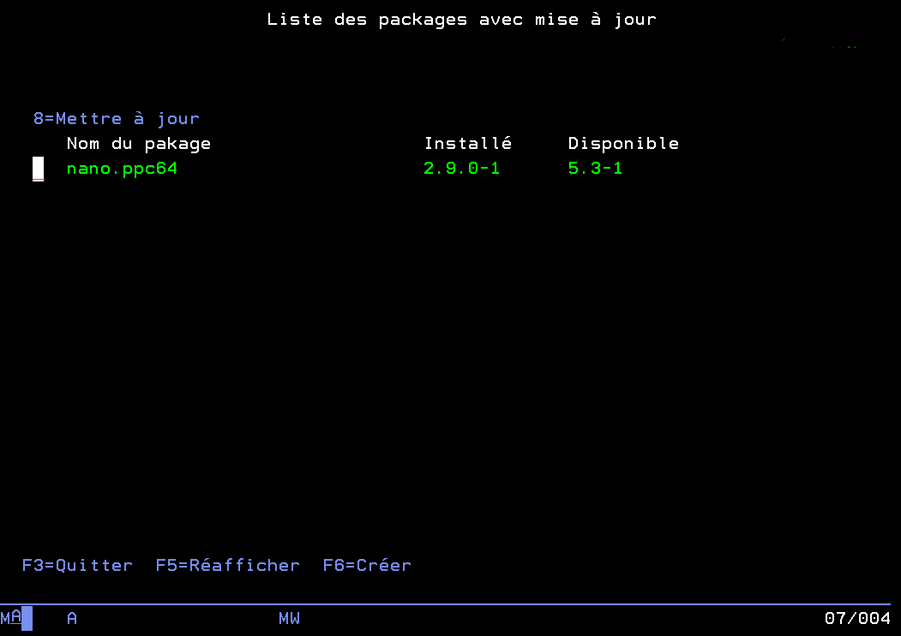

# GOPEN

GOPEN est un programme qui permet de contrôler les mises à jour open-source de l'IBM i depuis l'interface 5250.

## Menus
### Menu principal
Il dispose de plusieurs commandes pour le configurer, toutes aisément disponibles depuis le menu principal accessible avec la commande `GOPEN`.

### 1. Gestion du paramétrage
Permet la sélection de la bibliothèque GOPEN.

C'est ici que vous pouvez paramétrer l'adresse email qui recevra les notifications de GOPEN (mises à jour disponibles ou effectuées).

### 5. Gestion des packages à mettre à jour
Ce menu permet d'ajouter des packages pour lesquels vous recevrez des notifications lorsque des mises à jour seront disponibles. La commande "_Mettre à jour les packages suivis_" permet de faire les mises à jour de tous ces packages.

### 6. Rechercher les mises à jour disponibles
Cette commande (`RTVLSTUPD`) va rechercher toutes les mises à jour disponibles pour les packages ajoutés précédemment, et va garder une liste de ces mises à jour dans la table `GOPEN/LSTPKGMAJ`.

Vous recevrez également un email qui résumera dans un CSV en pièce jointe toutes les mises à jour disponibles.

Lorsque aucune mise à jour n'est disponible l'email vous l'indiquera également.

### 7. Mettre à jour un package
Ce menu vous permet de faire la mise à jour d'un package de votre choix à l'aide de la commande `UPDPKG`. Ici il faut donner vous-même le nom du package.

Vous recevrez un email résumant les changements effectués.

### 8. Mettre à jour les packages suivis
Cette option va faire toutes les mises à jour trouvées précédemment (des packages dans la table `GOPEN/LSTPKGMAJ`).

Vous recevrez un email résumant les changements effectués.

### 9. Gestion des packages avec modification
Ce menu vous permet de choisir quelles mises à jour effectuer parmi celles qui sont disponibles.

